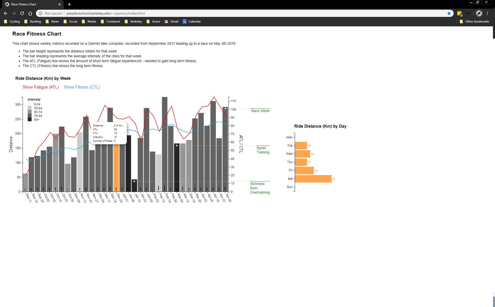

# cycleMetricsD3

Interactive Chart presenting cycling training metrics using __d3.js__

Data is collected from a Garmin edge 520 device, and summarized to 34 weekly events.

Features of the visualization are:

- linking bar Charts
- use of contrasting color for emphasis
- annotations
- hover
- overlaying line charts

The site can be cloned and served from a local web server, I use python:

```python -m http.server```

Alternatively the site is also hosted on my github jekyll site [Sexton Analytics](https://sextoncj.github.io)


